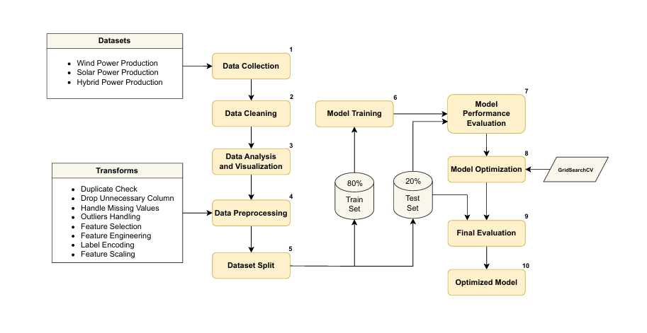

# Optimization and Simulation of a Hybrid Solar and Wind-Powered Industrial Data Center

## Description
As global data processing and storage demands surge, data centers have emerged as critical infrastructure hubs. However, these facilities consume vast amounts of energy, raising significant environmental concerns and driving up operational costs. To address these issues, leveraging renewable energy sources such as solar and wind power has become an increasingly viable solution for making data centers more sustainable and energy-efficient. This study focuses on modeling and simulating an industrial data center powered by both solar and wind energy, with the goal of integrating cutting-edge technology to reduce its carbon footprint and environmental impact.

Initially, we gathered datasets from solar, wind, and hybrid power stations. Next, we cleaned the data by removing duplicates, correcting data types, and filtering outliers. We then enhanced data visualization and analysis using Python libraries. For preprocessing, we applied eight distinct methods to prepare the data effectively. The dataset was subsequently divided into 80% for training and 20% for testing. Machine learning models were trained on the training set, and their performance was evaluated using the test set. We optimized the models using GridSearchCV and re-assessed their performance with the test data. Finally, we selected and formalized the model that achieved the highest performance scores.

## Methodology

### Software Block Diagram:

